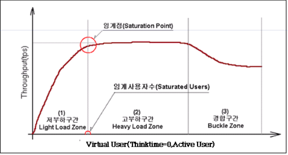

# Performance Test

단순히 부하테스트라고 생각 했었는데, 이번에 부하테스트 종류 에 대해서 알게 되면서 정리

## 성능 (Performance) 테스트

* Benchmark 목적

* 테스트 도구에서 초당 50,000 요청 수 가 발생 가능한 사용자 수를 확인 하여 테스트 조건으로 정의

* 자주 호출 되는 API 를 정의 하고, 해당 API 대상으로 어느 정도 성능 (RPS, Response) 인지 수치로 확인 하여 문서화

* 최대한 실제와 비슷한 수준으로 테스트 시나리오 작성

* 실제 부하에서 서버, 오류율, DB 등 관련 리소스 모니터링

## 부하 (Load) 테스트

* 부하를 지속적으로 증가 시키면서 최대 임계점 (Saturation Point) 확인

* 최대 임계점 보다 낮은 값을 시스템 최대 임계점 값으로 정의

* 현재 시스템에서 어느 정도 부하까지 처리 가능한지 확인

* 시스템 최대 임계점 에서 서버, DB, 오류율 등 관련 리소스 모니터링

* application 수정 사항, infra (DB, Server) 설정 등 올바르게 설정 되었는지 확인

* 현재 시스템에 대한 SLA 를 정의 = 시스템이 뻗는 부하 양을 확인 = 시스템이 안정적으로 운영될 수 있는 부하 수준을 확인

* 예를 들면 현재 시스템은 어느 어느 api 에 대한 rps 가 특정 수준까지는 처리 가능 하지만 그 이상 부하 에서는 처리가 불가능

## 스트레스 (Stress) 테스트

* 최대 임계점 (Saturation Point) 이상 으로 부하를 지속적으로 유지하여 테스트 진행

* 시스템이 죽을 때까지 부하를 발생 시키고, 시스템이 죽는 시점에 어떠한 상황인지 확인

* 어느 부하에서 시스템이 죽는지 확인 하고 어느 원인 때문에 죽는지 확인

* 개선 하기 위한 사항들 정의

## 특정 요구 사항에 부합 하는 성능 테스트

* 특정 요구 사항에 부합 하는 성능 테스트에 대한 요구 사항을 개발팀에 확인 하는 수준으로 현재 이슈에서 진행

* 이러한 형태의 테스트는 추후 요구 사항이 추가 될 가능성이 크므로 추후에 요구 사항 발생 시 고려

* 이러한 측정을 통해 향후 트래픽에 따른 시스템에 대한 성능 예측이 가능해짐

## 부하 테스트 후 서버 성능이 확인 가능해야 함

* 에러율, throughput, latency 등

## 참고 링크

* <https://www.softwaretestinghelp.com/what-is-performance-testing-load-testing-stress-testing/>
* <https://nesoy.github.io/articles/2018-08/Testing-Performance>
